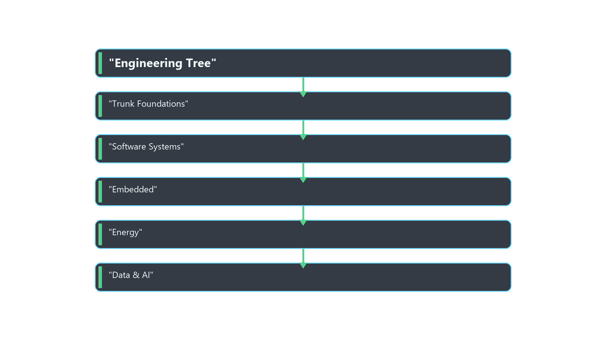
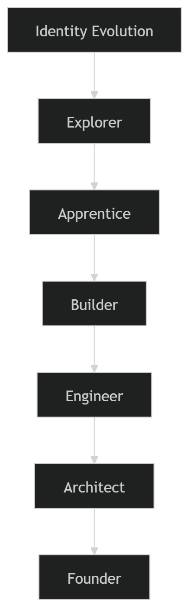
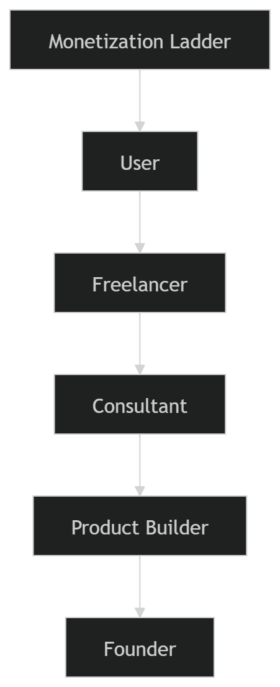

# Civilization Graph Community
*Powered by EruditeWBT*

A global learning ecosystem helping people understand **how the modern world works** — and how to grow within it.

---

## Vision

Most people learn technology by consuming tutorials.

But the modern world is built by people who can **understand systems** and **build outcomes**.

This community exists to help people move from:

Confusion → Clarity → Skill → Opportunity → Contribution.

Core translation formula:

`Field → Role → Skills → Tools → Projects → Income`

## Is This For Me?
Yes — if you’re a student, non‑tech professional, artist, healthcare worker, business operator, or engineer and you want a clear map + path.

---

## Civilization Graph (The Map)

Explore the graph:

- `docs/graph.html`
- Guided entry point: `docs/START.html`

Learn how to use it:

- `community_guides/HOW_TO_USE_THE_GRAPH.md`
- `civilization_graph/HOW_TO_READ_THE_GRAPH.md`

---

## Engineering Tree (The Path)

Everyone begins with a shared foundation.

Then members branch into:

- Software Systems
- Embedded & Hardware
- Data & AI
- Energy & Automation

Every branch leads to:

projects → proof → monetization → opportunity.

---

## Identity Evolution

Members progress through stages:

Explorer → Apprentice → Builder → Engineer → Architect → Founder.

---

## Monetization Path

Skills become income through:

Freelancing → Consulting → Products → Startups.

---

## Start Here

1. Read the Manifesto  
   `manifesto/BUILDER_MANIFESTO.md`
2. Guided entry point  
   `docs/START.html`
3. Introduce Yourself  
   `builders/profile_template.md`
4. Start a Project  
   `projects/project_template.md`

---

## Community

- Discord: https://discord.gg/8e4bQNknA
- Website (GitHub Pages): https://eruditewbt.github.io/Tech_Community_by_EruditeWBT/
- Knowledge Hub: (Notion/GitBook)
- YouTube: https://www.youtube.com/@eruditewbt
- LinkedIn (Founder): https://www.linkedin.com/in/chemiosis-daniel-34542826a

---

## Civilization Graph (Occupations)

This repo ships a **civilization-scale knowledge graph** focused on **occupations** and how they connect to tools, technologies, industries, and computing pillars.

- Open the interactive viewer: `docs/graph.html`
- Open exports (GraphML/JSONL): `civilization_graph/exports/global_v2_web/`

Guided entry point:

- `docs/START.html`

---

## Philosophy

We reject passive learning.

We believe in:

- building real systems
- documenting knowledge
- teaching forward
- creating economic opportunity

Builders build.
